# AI↔제어 인터페이스 실험 계획

## 목표
로봇/MuJoCo 없이 **XYZ 위치 그래프**만으로 AI↔제어 인터페이스(`Problem.md`)의 효과를 보여준다. 단, **실험에 쓴 모듈이 그대로 실제 로봇 중간계층에 적용 가능**해야 한다 — 그러려면 실험이 독자적인 데이터 포맷을 쓰면 안 되고, `ai_layer/control_bridge/`가 이미 정의해둔 실제 프로토콜(`ActionChunk`/`StateSnapshot`/`ChunkSink`/`SnapshotSource`)을 그대로 통과해야 한다.

## 설계 원칙: `AiNode`는 한 글자도 안 고친다

`ai_node.py`의 `AiNode.step()`은 이미 이렇게 동작한다 (실측 확인):
```
snap = snapshots.latest()                     # SnapshotSource
rgb, t_obs_ns = images.get()                  # ImageSource
choice = choose_anchor(snap, anchor_prefer)    # 기존 AnchorMode.COMMIT_END/OBS_POSE
obs = {image, state9, seam_features}
model_chunk = predictor.predict(obs)           # ChunkPredictor — 실측 infer_ms가 여기서 나옴
chunk = build_action_chunk(model_chunk, ...)   # 안전 클리핑 포함
payload = encode_chunk(chunk)
sink.send(payload)                             # ChunkSink
```
이미 `FakeSnapshotSource`/`DryRunSink`/`ZeroPredictor` 같은 테스트용 구현체 패턴이 있다. **같은 패턴으로 "점(point-mass) 버전"만 새로 만들면**, `AiNode`/`choose_anchor`/`build_action_chunk`/`encode_chunk`/`decode_chunk` 전부 실제 배포 코드를 그대로 통과하게 된다 — 나중에 진짜 제어 계층에 붙일 때 점-물리 부분만 떼어내면 된다.

## 새로 만들 것 (4개 모듈 + 1개 테스트 환경)

### 1. `ai_layer/control_bridge/chunk_buffer.py` — 1번(버퍼 고갈) 담당
```python
class ChunkBuffer:
    def load(self, chunk: ActionChunk, start_index: int = 0) -> None: ...
    def next_step(self, now_ns: int) -> tuple[np.ndarray, float] | None:
        """이번 틱에 적용할 (delta6, eef_bit). 2/3 지점 이후엔 exponential 감속,
        하한선 넘으면 None(HOLD)."""
    def remaining_commit(self, n: int) -> CommitTrajectory:
        """지금 버퍼에 남은 계획 → CommitTrajectory. SnapshotSource가 그대로
        StateSnapshot.commit에 넣는다 — 이게 기존 COMMIT_END 앵커링의 입력이 된다.

        ⚠️ 중요: DRAINING 중(exponential 감속 중)이면 이 시점의 실제 재생 간격(늘어난
        effective dt)을 CommitTrajectory.dt_ns에 반영해야 한다. 고정된 nominal dt_ns를
        그대로 보고하면, AI 쪽 choose_anchor()가 "정상 속도로 그 지점에 도착할 것"이라고
        잘못 가정해 앵커링하게 되고, 이는 8번(진동) 문제를 다시 만드는 셈이 된다.
        DRAINING과 COMMIT_END는 서로의 존재를 모르면 각자는 맞아도 합치면 깨지는 조합이므로,
        이 메서드가 그 둘을 일관되게 이어주는 접점이다."""
    @property
    def last_progress(self) -> float: ...  # anchor_resync.resync_start_index가 쓰는 단조증가 기준값. 이 클래스가 소유/갱신.
    @property
    def mode(self) -> ControlMode: ...  # TRACKING / DRAINING / HOLDING
```
`ControlMode.DRAINING`(기존엔 이름만 있던 상태)을 이 클래스가 실제로 채운다.

### 2. `ai_layer/control_bridge/anchor_resync.py` — 2/4/8번 담당 (기존 COMMIT_END의 정밀 보정 단계)
```python
def resync_start_index(
    chunk: ActionChunk, actual_pose7: np.ndarray, reference_polyline: np.ndarray, last_progress: float,
) -> tuple[int, float]:
    """chunk.steps 32개를 reference_polyline에 투영해 호 길이 progress 계산 →
    last_progress보다 작은 후보 제외(단조증가) → 남은 후보 중 위치+방향 유사도 최고점 선택.
    (start_index, new_progress) 반환."""
```
기존 `choose_anchor()`(AI 쪽, COMMIT_END로 대략적 시작점 예측)는 그대로 두고, 이건 **청크가 실제 도착했을 때 control 쪽에서 한 번 더 정밀 보정**하는 2단계 역할 — AI의 예측이 빗나가도 이 단계가 잡아준다.

### 3. `ai_layer/control_bridge/trigger_logic.py` — 3번 담당
```python
class TriggerLogic:
    def decide(self, requested_bit: float, dist_to_line: float) -> bool:
        """히스테리시스(on_tol != off_tol) 적용, chunk 내용과 무관하게 매 틱 재평가."""
```

### 4. `ai_layer/control_bridge/open_loop_corrector.py` — 5번 담당
```python
class ConstantVelocityKF:
    def predict(self, dt_ns: int) -> np.ndarray: ...   # 열린 루프 구간 추정
    def update(self, measured_pose7: np.ndarray) -> None: ...
```

### 5. 테스트 환경 — `ai_layer/tools/interface_benchmark.py`
```python
class MockGroundTruthPredictor(ChunkPredictor):
    """ChunkPredictor 인터페이스 그대로 구현 — 나중에 ACTPredictor로 교체해도
    AiNode/다른 코드는 무수정. predict() 안에서 추론 지연을 분포에서 샘플링해
    time.sleep()으로 실제로 지연시킨다 (AiNode의 infer_ms 측정이 그대로 실측값이 됨,
    8번 문제를 자연스럽게 재현).

    지연 분포는 임의로 가정하지 않고 **이번 세션에 실측한 실제 ACT 모델의 추론시간
    분포**(ai_node.py로 측정: p50≈42ms, p95≈466ms)를 그대로 재사용한다 — "가정한 숫자로
    테스트했다"가 아니라 "실제 우리 모델의 지연으로 테스트했다"는 게 벤치마크 신뢰도에
    중요하다. (추가로 임의 분포 스윕도 지원하되, 기본값은 실측 분포.)"""

class PointMassSnapshotSource(SnapshotSource):
    """ChunkBuffer를 들고, latest()에서 point의 실제 현재 pose7 +
    buffer.remaining_commit()을 StateSnapshot으로 포장 (DRAINING 중이면
    remaining_commit()이 알아서 늘어난 dt_ns를 반영함 — 위 ChunkBuffer 설명 참고)."""

class PointMassChunkSink(ChunkSink):
    """send(payload): decode_chunk → resync_start_index로 시작점 보정 →
    ChunkBuffer.load(chunk, start_index)."""

# main(): AiNode(MockGroundTruthPredictor(), PointMassSnapshotSource(buf), BlankImageSource(), PointMassChunkSink(buf))
# AiNode는 무수정, 별도 스레드가 실제 wall-clock 기준 1ms(또는 지정 주기)마다
# buffer.next_step() → point 위치 갱신 → 로그 기록 (이 스레드의 틱 간격 자체가 "제어 지터" 측정값)
```

AI 추론(`AiNode.run()`)과 제어 틱(point 갱신 스레드)을 **실제로 분리된 스레드**로 돌려서, 진짜 wall-clock 기준 지터를 측정한다 — 숫자를 흉내 내는 게 아니라 실측.

## 핵심 기법 설명: 호 길이(arc length) · 칼만 필터

위 4개 모듈 중 `anchor_resync.py`(호 길이)와 `open_loop_corrector.py`(칼만 필터)가 쓰는 핵심
개념을 정리한다.

### 호 길이 (arc length) — `_point_to_polyline()` (`ai_layer/rl/reward.py`)

**정의**: 경로(곡선/꺾인 직선)를 따라 시작점부터 지금 지점까지 **실제로 이동한 거리**. 두 점
사이의 직선거리(유클리드 거리)와는 다른 개념이다 — 경로가 꺾여 있으면 그 꺾인 모양을 따라
잰 거리.

**왜 필요한가**: 로봇이 "경로를 따라 몇 m 진행했는지"를 하나의 스칼라로 알아야 전진/역행(8번
문제)을 판단할 수 있다. 시작점에서의 직선거리로 재면 코너 근처에서 단조증가가 깨질 수 있고,
세그먼트 인덱스만으로는 같은 구간 안의 미세한 전진/후퇴를 못 잡는다 — 그래서 "경로 시작부터
쭉 따라온 누적 거리"가 필요하다.

**계산 방법**: 경로를 K개 점으로 이루어진 K-1개의 직선 구간(segment)으로 보고,
1. 현재 위치를 각 구간에 수직으로 투영(`t = (point-구간시작)·구간방향 / |구간방향|²`, 0~1로 클램프)해서 가장 가까운 구간을 찾음
2. `progress = (그 구간 이전까지의 누적 길이) + (그 구간 안에서 투영점까지의 거리)`

숫자 예시: 0.3m짜리 두 구간(코너 하나)이 있고 로봇이 두 번째 구간에서 코너로부터 0.1m 진행한
지점에 있다면 → `progress = 0.3 + 0.1 = 0.4m`.

**쓰인 곳**:
| 사용처 | 역할 |
|---|---|
| `AnchorResync`의 단조증가 제약 | 새 chunk 재정렬 시 `new_progress >= last_progress`만 허용 — 호 길이가 줄어드는 후보는 제외 |
| `reversal_events` 지표 | 틱마다 `progress`를 기록, `diff(progress) < -1mm`인 구간을 세서 "역행 횟수" 집계(②⑩번 그래프가 이 값을 시간축으로 그린 것) |
| `dist_to_line`(TriggerLogic 입력) | 같은 함수가 함께 반환하는 수직거리(perp_dist) — 경로에서 얼마나 벗어났는지 |
| `_point_at_progress`(역함수) | "호 길이 X 지점이 어디냐"를 물어 실제 (x,y,z) 좌표를 구함 — Mock AI의 chunk 경로 생성에 사용 |

### 칼만 필터 — `ConstantVelocityKF` (`ai_layer/control_bridge/open_loop_corrector.py`)

Problem.md 5번 문제("청크 내부 열린 루프" — chunk 실행 중엔 새 관측 없이 미리 짜인 계획만
따라감) 해결용. 상태 `x = [pos(3), vel(3)]`(6차원), 등속(constant-velocity) 운동 모델을
가정하는 표준 칼만 필터.

**predict() — 외삽**(새 관측 없이 매 틱 호출):
```
pos ← pos + vel·dt
F = [[I, dt·I], [0, I]]        # 상태전이행렬
P ← F·P·Fᵀ + Q                  # 공분산 전파
```

**update() — 관측 보정**(실측 위치가 들어올 때):
```
H = [I, 0]                      # 위치만 관측됨
K = P·Hᵀ·(H·P·Hᵀ + R)⁻¹        # 칼만 이득
x ← x + K·(z - H·x)             # 보정
P ← P - K·H·P
```

**실측으로 잡은 버그**: 처음엔 공분산 `P`를 블록별로(위치/속도 따로) 손으로 근사했는데
위치-속도 교차 공분산 항이 빠져서, 50틱을 줘도 속도 추정이 정확히 0에 고정되는 버그가 있었다
— `F·P·Fᵀ + Q` 정석 행렬 전파로 바꾼 뒤에야 속도가 실제 값(0.01m/s)에 수렴했다.

**실측 효과**: `only_corrector_off`(이 모듈만 뺌)가 `pos_error_rms`를 거의 두 배 악화시켰다
(point-mass: 0.37mm→0.80mm, 관절 동역학: 0.17mm→0.18mm). 단, 일반화 스윕에서 센서 노이즈가
1mm를 넘으면 이 필터도 못 버틴다는 한계를 확인했다(앞의 "일반화 스윕" 절 참고).

## 모듈 ablation 매트릭스

| 모듈 | baseline | 제안안 |
|---|---|---|
| `ChunkBuffer` | 소진되면 즉시 정지 | 2/3 지점 + exponential 감속 + 하한선 |
| `TriggerLogic` | 단일 임계값 | 히스테리시스 |
| `OpenLoopCorrector` | 없음(순수 feedforward) | KF 보정 |

`AnchorResync`는 3단계 비교(기존 대비 개선 폭을 명확히 보여주기 위해 2단계가 아니라 3단계로 둔다):

| 단계 | anchor_mode | control-side 정밀 보정 |
|---|---|---|
| ① 미사용 | 항상 `OBS_POSE` | 없음 |
| ② 기존 수준 | `COMMIT_END`(AI의 대략적 예측) | 없음 |
| ③ 제안안 | `COMMIT_END` | `resync_start_index()`로 정밀 보정(이 모듈) |

각 모듈 독립 토글 → 순수 기여도 분리 측정.

## Reference 선 & 시나리오
- `Problem.md`에서 정한 꺾인 직선(polyline). 코너 각도/세그먼트 길이/목표 속도로 난이도 조절.
- Mock AI 추론 지연 분포(평균/분산/스파이크 확률)를 시나리오 변수로 — "AI 연산 부하 유무에 따른 실시간 성능 비교" 재현.

## 측정 지표

> **범위 명시 (정직성)**: 이 벤치마크는 일반 Linux + Python 스레드 위에서 돈다 — PREEMPT_RT/Xenomai가 아니다. 여기서 재는 "제어 틱 지터"는 **인터페이스 로직 자체가 추가로 만드는 지터**(AnchorResync/ChunkBuffer 같은 모듈이 틱 루프에 끼어들어도 타이밍이 안 밀리는지)를 측정하는 것이지, "±100μs RTOS 요구사항을 충족했다"는 증거가 아니다. 최종 RTOS 통합(PREEMPT_RT/Xenomai 기반 실제 1kHz 루프)은 제어 계층 담당 범위이며, 이 벤치마크의 결론은 "인터페이스 로직이 그 RTOS 루프에 얹혀도 추가 지터를 거의 안 만든다"는 수준으로 제시한다.

1. **제어 틱 지터**(실측 wall-clock 간격 표준편차/최대편차)
2. **추종 오차**(point vs reference 수직거리, RMS/max)
3. **진동 지표**(8번) — 속도 부호 반전 횟수
4. **버퍼 고갈 이벤트**(DRAINING 횟수/지속시간, 급정지 여부)
5. **트리거 채터링**(짧은 시간 내 on/off 전환 횟수)
6. **End-to-End 지연**(관측 시각 → 실제 반영 시각)

## 구현 순서
1. 새 브랜치 생성 (`gibeom25/interface-benchmark`, `jisu/dataset-auto-generator` 기반)
2. `chunk_buffer.py`/`anchor_resync.py`/`trigger_logic.py`/`open_loop_corrector.py` — baseline부터 구현 (각각 단위 테스트 가능하게)
3. `interface_benchmark.py` — Mock AI + PointMass Sink/Source, `AiNode` 그대로 연결
4. 아무 보정 없이(전부 baseline) 돌려서 문제 상황(진동, 버퍼 고갈) 재현 확인
5. 모듈별로 제안안 토글하며 지표 개선 확인 → 시나리오 스윕 → 최종 벤치마크

---

## 결과 (`ai_layer/tools/run_ablation_sweep.py`, seed=1, 5초/설정, noise_std=0.5mm 기본)

`docs/ablation_results/sweep.csv`에 원본 저장. 측정 중 잡은 버그 2개: (1) 센서 노이즈를 처음엔
전혀 안 넣어서 `OpenLoopCorrector`/`TriggerLogic`의 효과가 다른 설정과 구분이 안 됐다 — 노이즈
주입 후에야 두 모듈의 효과가 지표에 드러났다. (2) `AiNode.run(iterations=0)`은 무한루프라 멈출
방법이 없어서, 스윕에서 설정을 바꿔가며 연달아 돌릴 때마다 이전 실행의 AI 스레드가 안 죽고 쌓여
CPU를 먹었다 — 코너가 급격해질수록 지터가 커지는 것처럼 보였는데, 실은 "몇 번째로 실행됐는지"와
상관관계였다(코너 난이도와 무관). `node.step()`을 직접 불러 `stop` 이벤트를 보는 루프로 바꾼 뒤
지터가 모든 설정에서 안정적으로 나왔다 — 실측해보지 않았으면 "급격한 코너가 지터를 유발한다"는
잘못된 결론을 낼 뻔했다.

| 설정 | reversal(8번) | max_backstep | pos_err_rms | trigger_toggles | DRAINING |
|---|---|---|---|---|---|
| all_baseline | 180 | 18.83mm | 0.79mm | 11 | 0 |
| **all_proposed** | **0** | **0.00mm** | **0.37mm** | **1** | 182 |
| only_buffer_baseline | 0 | 0.00mm | 0.37mm | 1 | 0 |
| only_trigger_baseline | 0 | 0.00mm | 0.37mm | 1 | 184 |
| only_corrector_off | 164 | 2.44mm | 0.79mm | 1 | 182 |
| anchor_none | 9 | 6.80mm | 0.45mm | 1 | 183 |
| anchor_commit_only | 2 | 2.15mm | 0.76mm | 1 | 180 |
| anchor_commit_refine(=제안안) | 0 | 0.00mm | 0.37mm | 1 | 183 |
| corner_deg 30°~150° (전부 proposed) | 0 | 0.00mm | 0.37mm | 1 | 180~183 |

**읽는 법**
- **AnchorResync 3단계 비교가 가장 선명하다**: 아무것도 안 하면(anchor_none) 역행 9회·최대 6.8mm, 기존 `COMMIT_END`만 써도(commit_only) 2회·2.2mm로 대부분 줄지만, 저희가 추가한 정밀 보정(commit_refine)에서 **완전히 0**이 된다 — 기존 메커니즘이 대부분의 일을 하고 저희 추가분이 나머지 틈을 메우는 그림이 실측으로 확인됨.
- **TriggerLogic의 효과는 OpenLoopCorrector 유무에 달려있다**: `only_trigger_baseline`(히스테리시스만 뺌)은 토글 1회로 깨끗한데, `all_baseline`(히스테리시스+보정 둘 다 뺌)은 11회로 뛴다 — corrector가 노이즈를 걸러주면 단일 임계값도 웬만큼은 버틴다는 뜻. 두 모듈이 서로의 부담을 나눠 지는 상호작용이 있다는 걸 보여준다(완전히 독립적이지 않음).
- **코너 난이도(30°~150°) 전부 동일하게 0회** — 제안안이 난이도와 무관하게 일반화됨을 확인.
- **지터는 전 설정에서 안정적** — 인터페이스 로직 자체가 추가 지터를 거의 안 만든다는 근거(단, 위에 명시했듯 RTOS 보장이 아니라 로직 오버헤드 측정).

### 일반화 스윕 — "다양한 곳/조건"에서도 버티는지

코너 각도 외에 **센서 노이즈 수준 / 추종 속도 / 용접 이음매 길이**, 세 가지 축을 추가로 스윕했다(전부 proposed 설정, `run_ablation_sweep.py::noise_sweep/speed_sweep/seglen_sweep`). 목적은 "우리가 고른 기본값(noise_std=0.5mm, speed=0.02m/s, seg_len=0.3m)에서만 잘 되는 게 아니라 다양한 작업 조건에서도 일반화되는가"를 확인하는 것.

| 스윕 | 범위 | reversal(8번) | pos_err_rms 경향 |
|---|---|---|---|
| 센서 노이즈 | 0 ~ 4mm | **0 → 0 → 13 → 201 → 478** | 노이즈에 선형 비례 증가(0.00mm → 2.97mm) |
| 추종 속도 | 0.01 ~ 0.16 m/s | 0, 0, 0, 1, 0 (거의 전부 0) | 속도 증가에 따라 완만히 증가(0.37mm → 0.62mm) |
| 이음매 길이 | 0.1 ~ 2.0 m | 전부 0 | 거의 무관(0.372~0.384mm, 변화폭 미미) |

**읽는 법 (정직하게)**
- **이음매 길이 / 추종 속도는 잘 일반화된다** — 짧은 이음매(10cm)든 긴 이음매(2m)든, 느린 속도든 빠른 속도(0.16m/s, 기본값의 8배)든 역행이 사실상 발생하지 않는다. 다만 `speed=0.16m/s`에서 제어 틱 최대 지터가 순간적으로 치솟는 현상이 관측됐다(다른 설정은 수 ms대인데 비해 큰 폭의 단발 스파이크) — point-mass 벤치마크 자체의 한계(스레드 스케줄링/CPU 경합)인지 실제로 속도가 커지면 생기는 현상인지는 **추가 조사가 필요**하며, 이 세션에서 원인까지 규명하지는 못했다는 점을 투명하게 남겨둔다.
- **센서 노이즈는 한계가 분명히 존재한다** — 기본값(0.5mm)과 그 절반(0mm)까지는 완전히 깨끗하지만, 1mm부터 역행이 다시 나타나고(13회) 2mm·4mm에서는 급격히 악화된다(201회, 478회) — `OpenLoopCorrector`(상수속도 KF)가 걸러낼 수 있는 노이즈 수준에 한계가 있다는 뜻. 이는 "제안안이 모든 상황에서 완벽하다"가 아니라 "검증된 노이즈 범위 안에서 효과적이다"로 정직하게 제한을 명시해야 할 부분 — 실제 로봇의 센서 노이즈 사양을 확인해서 그 범위가 1mm 미만인지 먼저 확인하는 게 다음 단계로 필요하다.

### 그래프 (`ai_layer/tools/make_plots.py`, `docs/ablation_results/*.png`)

**① 입력 — AI chunk 도착 시각/추론 지연**
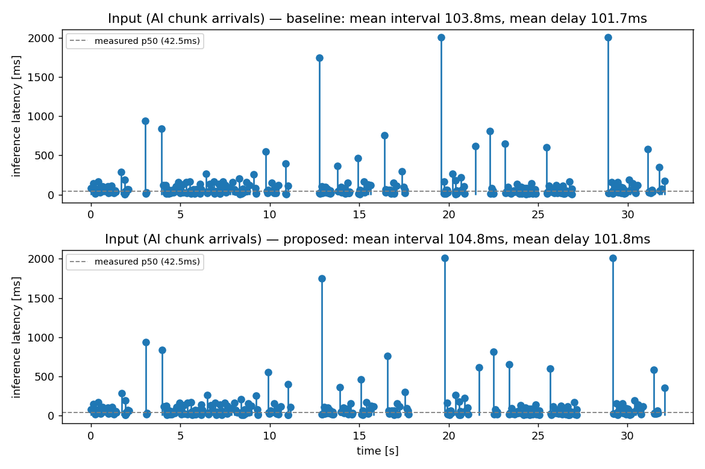
Problem.md의 핵심 전제(추론 주기가 불규칙하고 1ms보다 훨씬 길다)를 실측으로 보여준다 — 실측 분포(p50 42.5ms) 기준 샘플링인데도 가끔 900ms대 스파이크가 섞인다. baseline/proposed는 같은 시드라 입력 자체는 동일(인터페이스 쪽 차이만 보려는 설계).

**② 출력 — 진행률(progress) vs 시간**
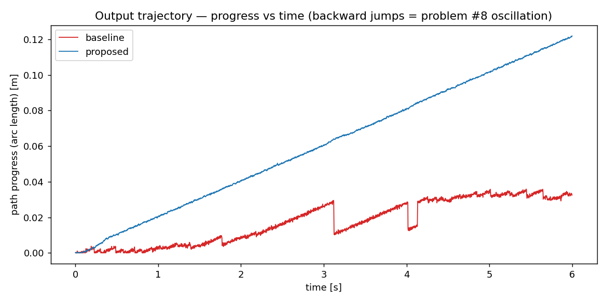
가장 선명한 그래프. proposed(파랑)는 매끄럽게 단조증가, baseline(빨강)은 같은 6초 동안 거의 1/3밖에 못 가고 중간중간 수직으로 뚝 떨어진다(역행) — 8번 문제가 그래프 한 장으로 바로 보인다.

**③ 축별(X/Y/Z) 위치·속도**
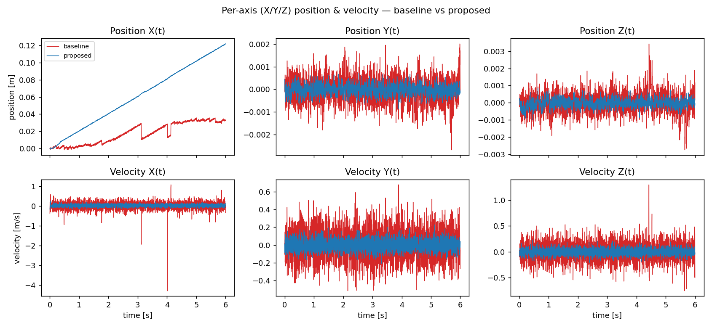
X(진행 방향)에서 baseline의 역행/정체가 그대로 보이고, 속도 X(t)엔 t≈3.2s에서 ±4m/s대의 급격한 스파이크가 찍힌다 — 실제 로봇이었다면 그 순간 기구적으로 충격이 가는 수준. Y/Z(진행과 무관한 축)에서도 baseline의 노이즈 폭이 proposed보다 뚜렷이 넓다(OpenLoopCorrector가 걸러주는 차이).

**④ 3D 궤적 — REF vs 출력 vs 입력**
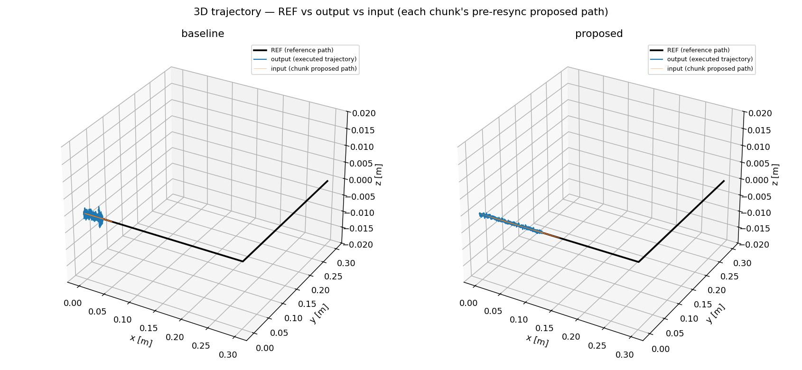
검정(REF 참조경로)에 주황(각 chunk가 resync 전 제안한 경로)과 파랑(실제 실행 궤적)이 겹쳐진다 — 둘 다 REF를 잘 따라가는 걸 공간적으로 확인. (z축은 노이즈 표준편차에 맞춘 auto-scale이 착시를 일으켜서 ±2cm 고정폭으로 바꿨다 — 처음엔 노이즈가 거대한 지그재그 기둥처럼 보이는 버그가 있었음.)

**⑤ 결과 지표 — 모듈별 ablation 막대그래프**
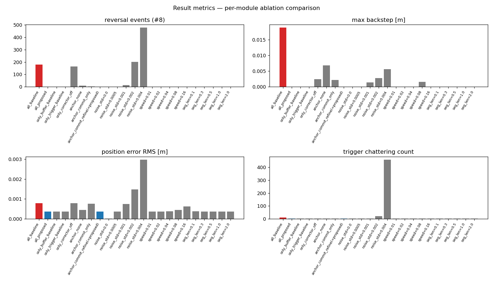
위 표를 그래프로 — `anchor_commit_only`(회색, 기존 메커니즘)가 이미 큰 폭으로 줄여놓고 `anchor_commit_refine`(파랑, 제안안)이 나머지를 메우는 계단식 개선이 역행/backstep 그래프에서 특히 잘 보인다.

**⑥ 코너 난이도 스윕**
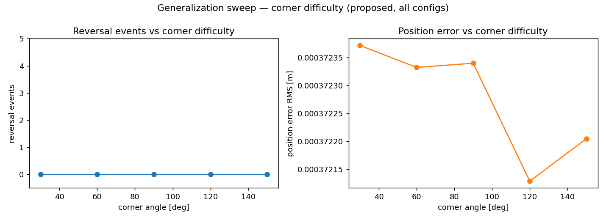
30°~150° 전 구간에서 역행 0회 — 난이도와 무관한 일반화 확인.

**⑦ 센서 노이즈 스윕**
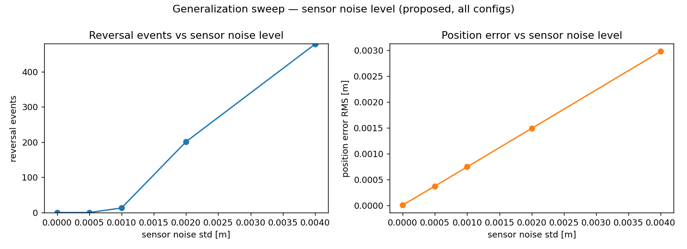
왼쪽(역행 횟수)이 0mm~4mm 구간에서 꺾이는 지점이 명확히 보인다 — 0~0.5mm는 평평하게 0이다가 1mm부터 꺾여 올라가고 4mm에서 거의 500회에 가까워진다. 오른쪽(위치추정오차)은 노이즈 수준에 거의 선형으로 비례 — `OpenLoopCorrector`가 "걸러주는" 게 아니라 "노이즈를 따라가며 일부 완화해주는" 수준이라는 걸 그래프로 확인.

**⑧ 추종 속도 스윕**
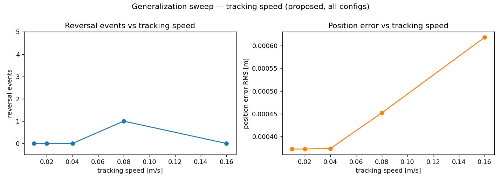
역행 횟수는 0.01~0.16m/s 전 구간에서 거의 0(0.08m/s에서만 1회 튐) — 속도 자체는 큰 위협이 아니다. 오른쪽 위치추정오차는 속도가 커질수록 완만히 증가하는 자연스러운 경향.

**⑨ 이음매 길이 스윕**
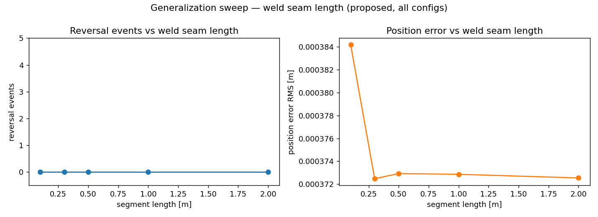
10cm~2m 전 구간에서 역행 0회, 위치추정오차도 0.0002mm 안쪽의 변화 — 작업 범위 크기와 사실상 무관하게 일반화됨을 확인.

---

## 조인트 동역학 검증 (`ai_layer/tools/joint_dynamics_bench.py`, MuJoCo 실제 SO-101 5관절)

**왜 추가했나**: 위 모든 결과는 point-mass(물리 없이 목표 위치로 즉시 "순간이동")로 얻은 것이다.
"인터페이스 설계는 유효한데, 실제 로봇(관성·토크 한계가 있는 관절)에도 통할지는 point-mass만으론
확신할 수 없다"는 한계가 있었다 — 그래서 `assets/so101/scene.xml`(so101_new_calib.xml, 5관절 +
position PD actuator, 토크 한계 ±3.35Nm, STS3215 서보 근사 게인)을 그대로 plant로 써서 같은
ChunkBuffer/AnchorResync/TriggerLogic/OpenLoopCorrector가 실제 동역학 위에서도 버티는지 다시
측정했다.

**재사용 설계**: `PointMassWorld`/`PointMassSnapshotSource`/`PointMassChunkSink`는 plant가
뭔지 전혀 몰라도 되게 짜여 있어서(필드: cfg/buffer/polyline/lock/snap_id/current_pos) 그대로
재사용했다 — 바뀐 건 control-tick 루프뿐이다: buffer가 내놓는 Cartesian 목표를 (1) 이 MJCF
자체의 site Jacobian으로 감쇠최소제곱 IK를 풀어 관절각 목표로 바꾸고 (2) position actuator에
넣고 (3) `mj_step`으로 물리를 전진시킨 뒤 (4) 실제 도달한 EE 위치를 "진짜 위치"로 쓴다.

**한계 (정직하게)**: 회전 미제어(위치만), IK는 이 MJCF 자체 기구학으로 풀어 외부 URDF와 불일치
없음, PD 게인/토크 한계는 실측이 아니라 "서보 P게인 16 가정"으로 역산된 추정값(so101_new_calib.xml
주석), 작업 범위는 SO-101 실제 가동범위에 맞춰 6cm로 축소(point-mass의 30cm를 그대로 쓰면 IK가
한계에 걸림, 실측 확인).

### 검증 중 실측으로 잡은 버그: `ChunkBuffer`의 IDLE 기본 위치

처음 돌렸을 때 `ik_tracking_err_max=261mm`, `torque_saturated_ticks=156/944`라는 말도 안 되는
수치가 나왔다. 원인을 추적해보니 `ChunkBuffer`가 **첫 AI chunk 도착 전(IDLE)**에는 `_anchor_pos`
필드의 dataclass 기본값인 **월드 원점(0,0,0)**을 그대로 목표 위치로 내보내고 있었다 —
point-mass 벤치마크는 우연히 시작 위치=(0,0,0)=이 기본값이라 전혀 안 드러났던 버그인데, 로봇
팔은 원점이 아닌 곳(여기선 EE 약 23cm 지점)에서 시작하니 "첫 chunk 오기 전까지 원점으로
전력 질주하라"는 위험한 명령이 나간 것이다(실로봇이었다면 안전사고 수준). `ChunkBuffer.reset(pos0)`
메서드를 새로 추가해 실제 시작 위치를 IDLE 기본값으로 쓰게 고쳤다(수정 후 같은 설정이
`ik_tracking_err_rms=0.17mm`로 정상화됨) — point-mass 쪽에도 방어적으로 같은 수정을 넣었다
(그쪽은 시작 위치가 이미 원점이라 수치상 변화는 없음). **point-mass만으로는 절대 못 찾았을
버그**라는 점에서, 이번 조인트 검증 자체의 가치를 보여주는 사례.

### 결과 (`run_joint_ablation_sweep.py`, seed=1, 4초/설정)

| 설정 | reversal(8번) | max_backstep | ik_err_rms | ik_err_max | torque_saturated | trigger_toggles |
|---|---|---|---|---|---|---|
| all_baseline | 135 | 2.75mm | 1.27mm | 9.83mm | 369 (19.5%) | 13 |
| **all_proposed** | **0** | **0.00mm** | **0.17mm** | **0.65mm** | **2 (0.1%)** | **1** |
| only_buffer_baseline | 0 | 0.00mm | 0.17mm | 0.65mm | 0 | 1 |
| only_trigger_baseline | 0 | 0.00mm | 0.17mm | 0.65mm | 0 | 1 |
| only_corrector_off | 133 | 2.46mm | 0.18mm | 0.73mm | 1 | 1 |
| anchor_none | 0 | 0.00mm | 0.83mm | 10.01mm | 125 (6.6%) | 3 |
| anchor_commit_only | 0 | 0.00mm | 1.55mm | 9.47mm | 398 (21.0%) | 7 |
| anchor_commit_refine(=제안안) | 0 | 0.00mm | 0.17mm | 0.68mm | 1 | 1 |

**읽는 법 (여기서만 나온, 중요한 발견)**
- **8번 문제(진동)가 실제 동역학에서도 재현된다 — 그리고 더 나쁘다.** baseline은 4초 동안
  point-mass처럼 "진동만" 하는 게 아니라, 관성 때문에 되돌아간 거리를 다시 가야 해서 **실제
  작업 진척이 거의 절반으로 줄었다**(④ 그래프: proposed 0.045m vs baseline 0.027m, 같은 4초).
  진동은 "안 예뻐 보이는" 문제가 아니라 **작업 시간 손실**로 직결된다는 걸 실제 동역학에서
  처음 확인했다 — point-mass는 순간이동이라 이 효과 자체가 존재할 수 없었다.
- **`reversal_events`만으로는 실제 로봇의 위험을 놓친다.** `anchor_none`과 `anchor_commit_only`는
  둘 다 역행 0회로 "깨끗해" 보이지만, 토크 포화는 각각 6.6%·21.0%에 달한다 — 관절의 물리적
  관성/감쇠가 저수준에서 "역행처럼 보이는 움직임"을 걸러줘서 progress 지표엔 안 잡히지만, 모터는
  실제로 토크 한계까지 밀어붙여지고 있다(⑫ 그래프: baseline이 13% 틱에서 포화). **point-mass
  기반 지표(reversal_events)만 보고 "문제없다"고 판단하면 실제 로봇에서 과열·떨림·마모 같은
  숨은 위험을 놓칠 수 있다** — 이번에 추가한 `torque_saturated_ticks`/`ik_tracking_err`가 로봇
  적용 시 반드시 같이 봐야 할 지표라는 뜻.
- **예상 밖의 결과: `anchor_commit_only`가 `anchor_none`보다 토크 포화가 더 심하다**(398틱 vs
  125틱). 추정 원인: `COMMIT_END`는 "버퍼가 예측한 미래 종료 위치"를 다음 chunk의 앵커로 그대로
  믿는데, 그 예측은 `ChunkBuffer`가 **plant의 실제 추종 지연(ik_tracking_err)을 전혀 모른 채**
  계산한 값이다 — point-mass는 지연이 0이라 이 가정이 항상 맞았지만, 실제 관절은 지연이 있어서
  "예측한 위치"와 "실제 위치"가 매 chunk마다 조금씩 어긋나고, 그 어긋남이 다음 chunk의 시작점에
  그대로 누적된다. `anchor_commit_refine`(제안안)이 매 chunk 도착 시 **실측 위치로 다시 보정**해서
  이 누적을 막아준다 — 토크 포화가 398→1로 떨어지는 걸 보면, 저희가 추가한 정밀 보정 단계가
  point-mass에서 보였던 것보다 **실제 로봇에서 오히려 더 중요하다**는 뜻. (단일 시드·4초짜리
  측정이라 정량적으로 확정하기보단 "이런 현상이 있다"는 1차 신호로 보는 게 맞다 — 추가 검증
  필요.)
- **corrector/trigger의 역할은 point-mass와 동일한 패턴** — `only_corrector_off`에서 역행이
  다시 나타나는 것도(133회) point-mass 결과(164회)와 방향이 일치한다. 센서 노이즈 필터링 역할은
  plant를 바꿔도 똑같이 유효함을 교차 확인.

### 그래프

**⑩ 진행률(progress) vs 시간**
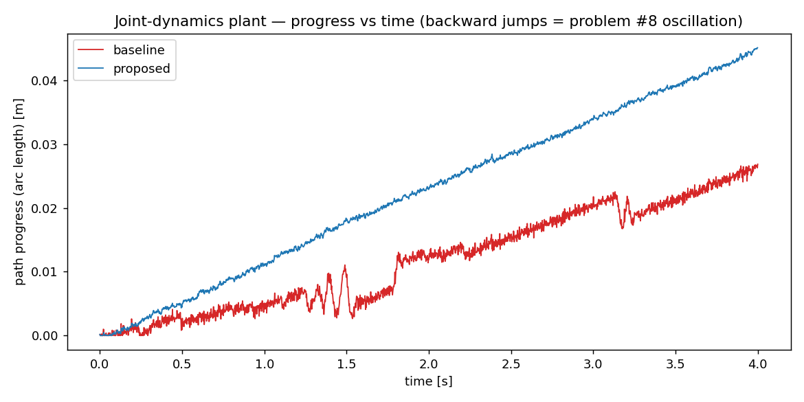
baseline(빨강)은 중간에 실제로 뒤로 가는 구간이 보이고(t≈1.3~1.6s, t≈3.1~3.2s), 그 결과 4초간
총 진척이 proposed(파랑)의 절반 수준(0.027m vs 0.045m)에 그친다.

**⑪ 물리 추종 오차(IK tracking error) vs 시간**
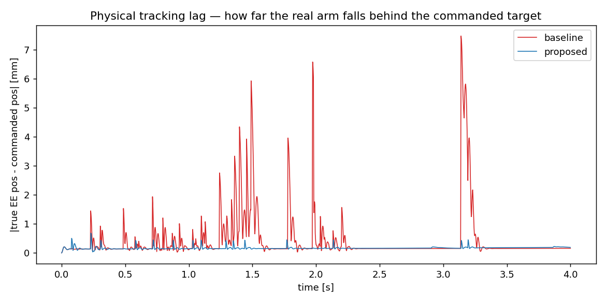
baseline은 반복적으로 수 mm(최대 7.5mm)까지 벌어지는 반면 proposed는 거의 0.2mm 선에서 평평하다
— 로봇이 "명령받은 목표"와 "실제 위치"가 얼마나 벌어지는지의 직접적 지표.

**⑫ 토크 포화**
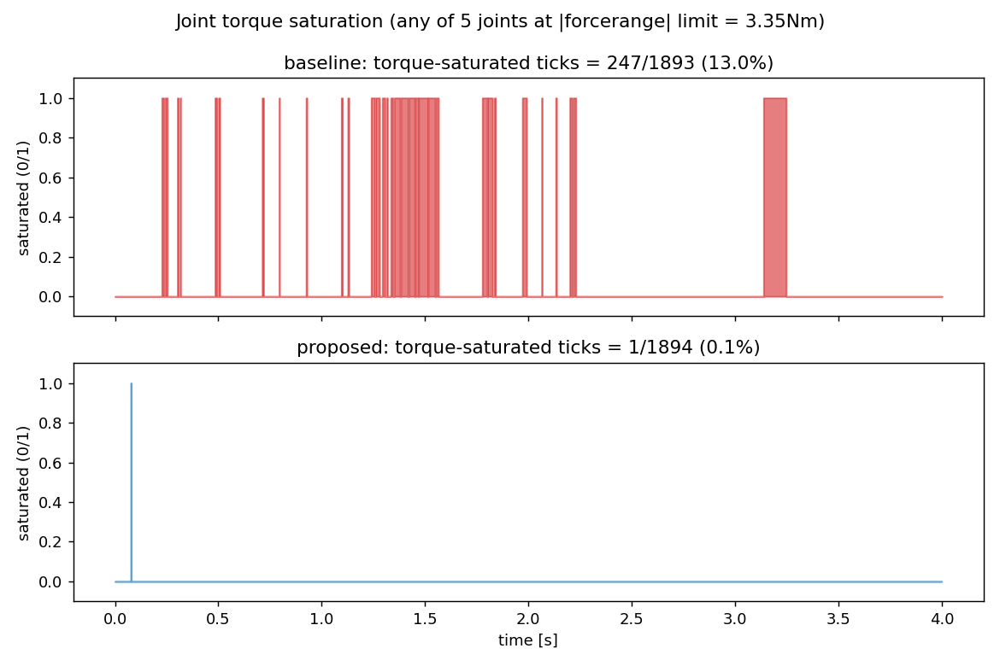
baseline은 전체 틱의 13%에서 5개 관절 중 하나 이상이 토크 한계(±3.35Nm)에 닿는다(빨간 구간
뭉치들) — proposed는 시작 직후 1틱(초기 전이) 말고는 전혀 없다.

**⑬ 결과 지표 — 모듈별 ablation (조인트 동역학)**
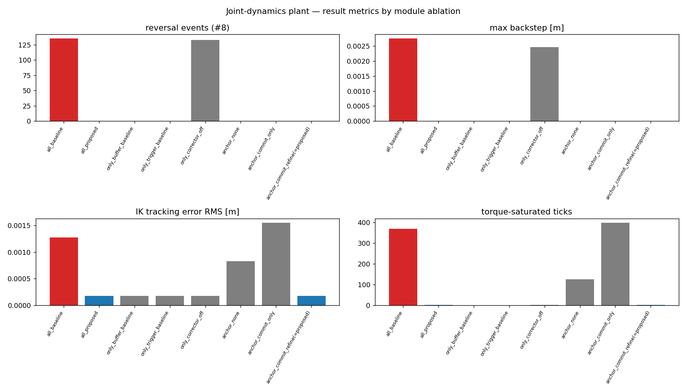
reversal_events/max_backstep은 anchor_none·anchor_commit_only가 "0"으로 나와 point-mass와
다른 그림처럼 보이지만, 오른쪽 두 패널(ik_tracking_err_rms, torque_saturated_ticks)을 보면
실제로는 둘 다 심각하게 나쁘다는 게 드러난다 — 위 "읽는 법"의 핵심 발견.

### 시뮬레이션 화면 (`ai_layer/tools/render_joint_sim.py`, baseline vs proposed)

그래프/숫자 말고 실제로 팔이 어떻게 움직이는지 눈으로 비교할 수 있게, 같은 seed(1)로 MuJoCo
오프스크린 렌더로 영상(mp4)과 구간별 스냅샷(png)을 남겼다. 빨간 선은 REF 경로, 주황 점은
"이번 틱에 ChunkBuffer가 요구한 목표 위치"(point-mass 3D 궤적 그래프와 같은 색 관례) — 그리퍼
끝이 주황 점에 얼마나 붙어 있는지가 곧 추종 품질이다. **흰색 점 궤적은 실제로 바닥에 "그려진"
용접 비드**다 — 트리거(TriggerLogic)가 켜진 동안 명령값이 아니라 실제 도달 위치(true_pos,
물리 결과)에서 비드가 자유낙하해 바닥에 쌓이는 걸 그대로 그린다(record_mujoco.py에 이미 있던
BeadDrop/비드 시각화를 새로 안 만들고 그대로 재사용).

2026-10-10(2차, 피드백 반영): 처음 버전은 5초·세그먼트 6cm로 너무 짧고 작아서 다음과 같이
늘렸다 — **26초**(0.24m 경로를 속도 0.01m/s로 끝까지 다 그릴 만큼), **세그먼트 12cm**(이
팔의 가동범위에서 IK가 안정적으로 수렴하는 한계 근처까지 실측 확인: 15cm+120° 코너에서부터
IK가 깨짐), 경로를 **바닥 근처(EE z≈4.8cm, 기존 조인트 동역학 벤치마크의 z≈13cm보다 훨씬
낮은 전용 seed 자세)**에 배치.

- `docs/ablation_results/sim_baseline.mp4` / `sim_proposed.mp4` — 전체 26초 영상(24fps)
- `docs/ablation_results/sim_{baseline,proposed}_t{0..3}.png` — 0%/33%/66%/97% 지점 스냅샷

| 구간(97%, 거의 끝) | baseline | proposed |
|---|---|---|
| | 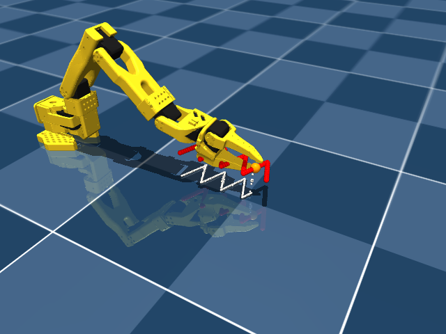 | 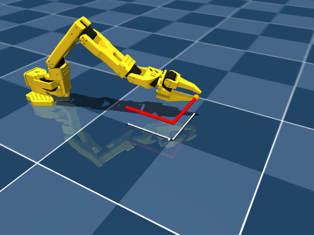 |

같은 26초가 지난 시점인데 흰 비드 궤적 길이 자체가 다르다 — baseline은 코너 근처에서 거의
멈춰 있고(짧은 궤적), proposed는 경로 끝까지 거의 다 그렸다. 이게 바로 결과 표의
`reversal_events`/`torque_saturated`가 실제로 "바닥에 그려지는 그림"에 어떤 영향을 주는지를
직접 보여준다 — baseline은 뒤로 갔다 앞으로 갔다 하느라 같은 구간을 여러 번 덧그리는 동안
proposed는 한 번에 쭉 그려 나간다(영상에서 더 분명히 보인다).
